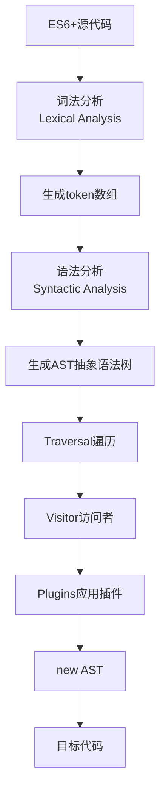

# 学习笔记

## babel

ES6+新出现的语法, 数据类型, 类, API 等, 对于不支持 ES6 的旧浏览器, 就需要 babel 将代码编译成 ES5 代码.

不管在什么工具下使用 babel 都必须安装 core 包文件:

`yarn add @babel-core`

在终端使用 babel, 将 src 文件夹下的源文件编译输出到 result 文件夹下:

`npx babel src --out-dir result`

不使用任何插件的情况下 babel 什么都不会做, 下面使用插件举例:

安装处理箭头函数插件: `yarn add -D @babel/plugin-transform-arrow-functions`,

安装处理 const,let 插件: `yarn add -D @babel/plugin-transform-block-scoping`,

`npx babel src --out-dir result --plugins=@babel/plugin-transform-arrow-functions,@babel/plugin-transform-block-scoping`

编译结果:

```js
"use strict";
var message = "Hello world";
var foo = function foo(name) {
  console.log(name);
};

foo(message);
```

如果要使用其他插件可以在--plugins 后添加
一个一个安装插件的方式不是很方便, babel 提供了了`@babel/preset-env`包预设了会使用的 plugins, 安装:

`yarn add -D @babel/preset-env`

使用: `npx babel src --out-dir --presets=@babel/preset-env`

## babel 原理

一张图介绍 babel 的底层原理, 可以通过[在线工具(https://esprima.org/demo/parse.html)查看转换结果



## babel in webpack

~~正常开发也不可能在命令行使用 babel~~
安装`babel-loader`: `yarn add -D babel-loader`
`babel-loader`和`@babel/cli`一样都是特定工具下使用时需要安装的包文件.
babel 在 webpack.config.js 中配置, **这里注意`exclude: /node_modules/`, 如果 babel 处理 node_modules 中的文件很有可能报错**:

```js
rules: [
      {
        test: /\.js$/i,
        exclude: /node_modules/,
        use: {
          loader: 'babel-loader',
          options: {
            // plugins: ['@babel/plugin-transform-arrow-functions', '@babel/plugin-transform-block-scoping'],
            presets: [
              ['@babel/preset-env', {
                // targets: ["chrome 88"],
                // enmodules: true,
              }]
            ]
          },
        },
      },
    ],
```

可以看到和命令行使用非常类似, 不过是使用了 js 对象, 这里就直接使用预设`@babel/preset-env`, 这里不推荐在 presets 中配置 target, 建议和 postcss 等工具一起通过`.browserslistrc`配置兼容的浏览器范围.

现在 babel 最新版本为 7.x, 如果旧项目使用的是 babel7 之前的大版本, 经常会看到

```js
presets: [["es2015"], ["react"], ["stage-1"]];
```

babel7 开始已经不建议使用, stage-x, es20xx 已废弃, 替换为`@babel/preset-env`; react 替换为`@babel/preset-react`

像 postcss 可以单独配置 postcss.config.js 文件一样, babel 也可以单独配置, 文件命名: `babel.config.[json|js|cjs|mjs] | .babelrc[.json|.js|.cjs|mjs`, 后续都会在 babel.config.js 中修改.

配置:

```js
module.exports = {
  // plugins: [],
  presets: [["@babel/preset-env"]],
};
```

### polyfill

babel 默认只处理语法相关, 当我们使用新特性, 数据类型, 类或者 API(例如 Promise, Generator, Symbol, API 如 Array.prototype.includes), 就需要使用 polyfill

在 babel7.4 之后就不建议使用`@babel-polyfill`, 推荐使用`core-js`和`regenerator-runtime`, 安装:
`yarn add core-js regenerator-runtime`

然后在 babel.config.js 中配置:

```js
module.exports = {
  presets: [
    [
      "@babel/preset-env",
      {
        useBuiltIns: "usage",
        corejs: 3, // 必须填默认corejs: 2会报错
      },
    ],
  ],
};
```

useBuiltIns:

- 默认为`false`, 不引入任何 polyfill 逻辑, 即还是只处理语法;
- `'usage'`, 分析源代码中需要的 polyfill 以及`.browserslistrc`涉及的浏览器是否支持该 polyfill 按需引入
- `'entry'`, 需要手动在入口文件顶部引入以下包, 然后根据`.browserslistrc`引入剩余不支持的所有 polyfill, 因为引入的所有的包, 响应的打包体积会变大.

```js
import "core-js/stable";
import "regenerator-runtime/runtime";
```

corejs:
babel 默认使用 corejs 为`2`, 但是安装的最新`@babel/core`版本为 3.x, 所以需要修改 corejs 为`3`, 也可以具体到小版本`3.8`.

#### @babel/plugin-transform-runtime

polyfill 默认情况下添加的所有特性都是全局的, 如果编写第三方库需要使用 polyfill 就有可能污染全局作用域, 为了解决这个问题需要安装`@babel/plugin-transform-runtime`来添加 polyfill.

关于`useBuiltIns`和`@babel/plugin-transform-runtime`的区别, babel 开发人员做出了回答[https://github.com/babel/babel/issues/10271](https://github.com/babel/babel/issues/10271):

> useBuiltIns and @babel/plugin-transform-runtime are mutually exclusive. Both are used to add polyfills: the first adds them globally, the second one adds them without attatching them to the global scope.
> You should decide which behavior you want and stick with it.

根据自己的场景使用`useBuiltIns`还是`@babel/plugin-transform-runtime`.

### babel with react

react 脚手架就是通过`@babel/preset-react`来解析 JSX 文件的, 用一个简单的 demo 介绍下 babel 在 react 中的使用.

`babel.config.js`:

```js
module.exports = {
  presets: [
    [
      "@babel/preset-env",
      {
        useBuiltIns: "usage",
        corejs: 3,
      },
    ],
    ["@babel/preset-react"],
  ],
};
```

`index.jsx`:

```jsx
import React, { Component } from "react";
import ReactDOM from "react-dom";

function Home() {
  return (
    <div>
      <h2>Hello World</h2>
    </div>
  );
}

ReactDOM.render(<Home />, document.getElementById("app"));
```

`template.html`:

```html
<!DOCTYPE html>
<html lang="en">
  <head>
    <meta charset="UTF-8" />
    <meta http-equiv="X-UA-Compatible" content="IE=edge" />
    <meta name="viewport" content="width=device-width, initial-scale=1.0" />
    <title>Day6 p2</title>
  </head>
  <body>
    <div id="app"></div>
  </body>
</html>
```

打包结果:


可以看到正常展示了.

# 示例代码

[https://github.com/Mariana-Yui/fe-learn-code/tree/main/learn-webpack/day6](https://github.com/Mariana-Yui/fe-learn-code/tree/main/learn-webpack/day6)

# reference

[babel 在线词法分析/语法分析](https://esprima.org/demo/parse.html#)
[前端 Javascript: Babel 怎么把字符串解析成 AST，是怎么进行词法/语法分析的？](https://juejin.cn/post/6844903992762318855)
